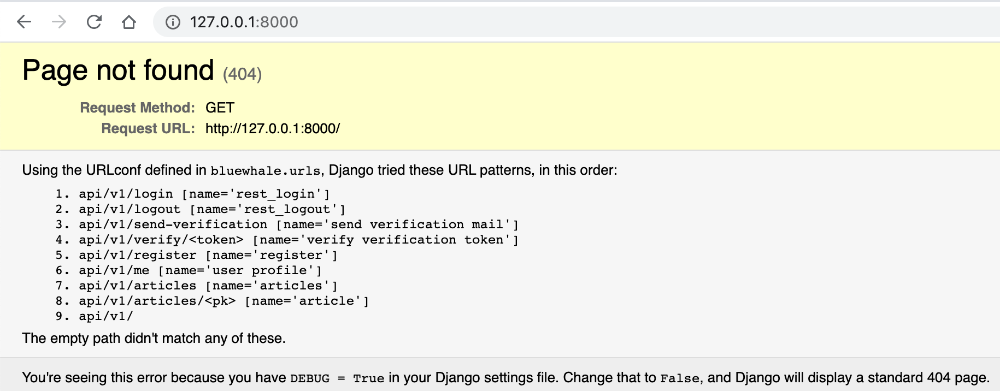
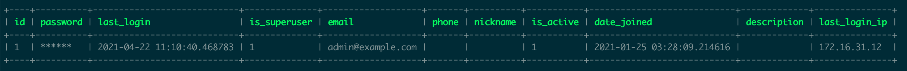
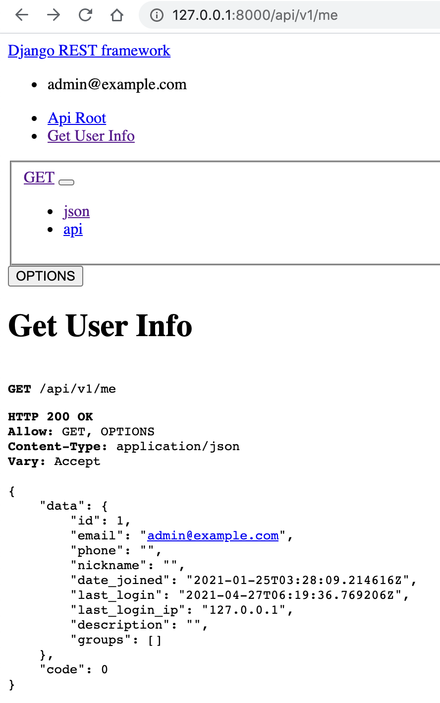
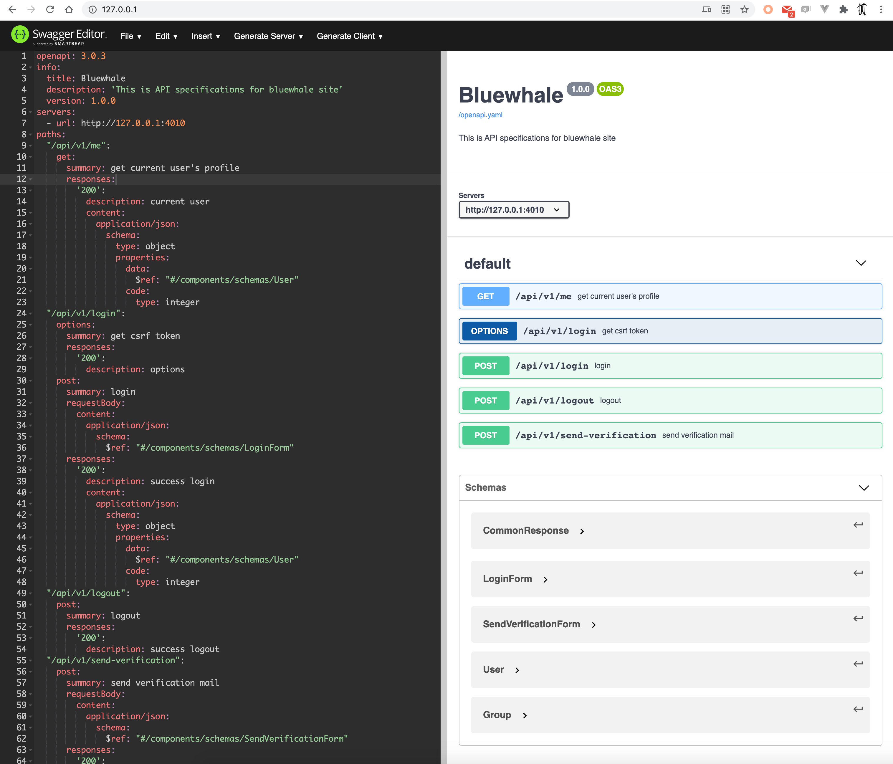
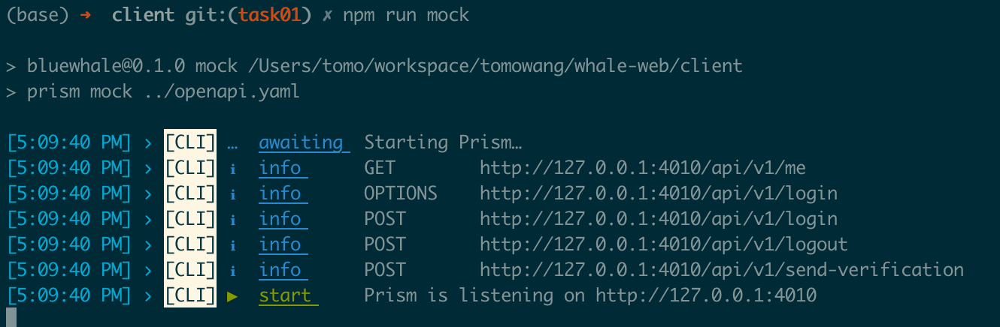
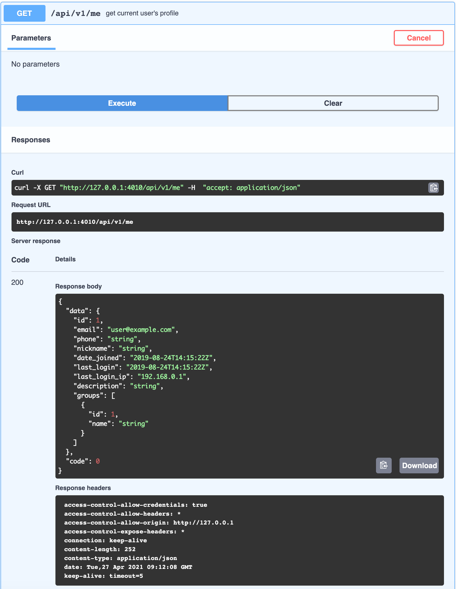

# 前言

本节课程，你将熟悉后端目录结构、数据库关系映射及API实现方式，并使用OpenAPI编写RESTful接口。

# 后端目录结构

后端使用Django开发，子目录为`backend`。该目录通过命令`django-admin startproject bluewhale`创建，
然后重命名为`backend`，Django项目由一个或多个应用组成。详细的目录结构如下：

```shell
├── Pipfile
├── Pipfile.lock
├── manage.py
├── bluewhale
│   ├── __init__.py
│   ├── asgi.py
│   ├── settings.py
│   ├── urls.py
│   └── wsgi.py
├── blog
│   ├── __init__.py
│   ├── admin.py
│   ├── apps.py
│   ├── migrations
│   ├── models.py
│   ├── serializers.py
│   ├── tests.py
│   └── views.py
├── common
│   ├── __init__.py
│   └── utils.py
├── core
│   ├── __init__.py
│   ├── admin.py
│   ├── apps.py
│   ├── migrations
│   ├── models.py
│   ├── serializers.py
│   ├── tests.py
│   ├── views.py
│   └── viewsets.py
```

其中
* `manage.py`是服务入口，通过该脚本可以与Django项目进行交互。通过运行`python manage.py`可以看到支持的命令，
常用的命令有
  - `runserver` 启动后端服务
  - `makemigrations` 生成数据库迁移脚本
  - `migrate` 更新数据库schema
* `bluewhale`为项目目录，主要包括配置及后端路由
  - `settings.py` 项目配置，包括应用配置、中间件、数据库、缓存、日志等
  - `urls.py` URL与View的关联配置，通过`urlpatterns`配置URL至处理函数或者类的映射关系
  - `wsgi.py`及`asgi.py` 使用WSGI或ASGI入口部署应用
* `blog` & `core` 应用目录，使用`python manage.py startapp <APP_NAME>`创建的应用，创建后的应用会在DB中有
独立的表前缀，如需加载应用，需在`bluewhale/settings.py`中的添加，参考目前的配置：
    ```python
    INSTALLED_APPS = [
        # ...
        'core',
        'blog'
    ]
    ```

    其中的关键文件如下：

    - `admin.py` - 注册model至`django admin`应用（本次课程不涉及）
    - `apps.py` - app级别配置文件
    - `models.py` - 数据库对象关系映射
    - `tests.py` - 测试
    - `views.py` - Views，展示相关
    - `migrations` - 自动生成的数据库表迁移脚本


# 服务及接口

当前基础代码包含两个App，`core`与`blog`。其中core为核心App，负责处理认证与权限相关功能；blog为博客应用，
负责文章管理等功能。对应的接口定义如下（在文件`bluewhale/urls.py`中定义）：

```python
urlpatterns = [
    path(f'{api_prefix}/login', BluewhaleLoginView.as_view(), name='rest_login'),
    path(f'{api_prefix}/logout', LogoutView.as_view(), name='rest_logout'),
    path(f'{api_prefix}/send-verification', send_verification_mail, name='send verification mail'),
    path(f'{api_prefix}/verify/<token>', verify_verification_token, name='verify verification token'),
    path(f'{api_prefix}/register', register, name='register'),
    path(f'{api_prefix}/me', get_user_info, name='user profile'),

    path(f'{api_prefix}/articles', ArticleListCreateView.as_view(), name='articles'),
    path(f'{api_prefix}/articles/<pk>', ArticleDetailView.as_view(), name='article'),
]
```

其中前6个接口为登录、登出及用户注册相关接口，后两个为文章管理相关接口。

在开发模式下，直接访问[http://127.0.0.1:8000/](http://127.0.0.1:8000/)可以通过页面看到支持的接口列表：



## 用户相关Model及数据表

### User Model

我们使用自定义的用户Model来处理用户相关属性（参考`settings.py`中的`AUTH_USER_MODEL = 'core.User'`）。具体定义如下：

```python
class User(AbstractBaseUser, PermissionsMixin):
    email = models.EmailField(_('email address'), unique=True)
    phone = models.CharField(_('phone'), max_length=30, blank=True, unique=True, null=True)
    nickname = models.CharField(_('nickname'), max_length=150, blank=True)
    is_active = models.BooleanField(
        _('active'),
        default=True,
        help_text=_('Designates whether this user should be treated as active. '
                    'Unselect this instead of deleting accounts.'),
    )
    date_joined = models.DateTimeField(_('date joined'), default=timezone.now)
    description = models.TextField(_('description'), blank=True)
    last_login_ip = models.CharField(_('last login ip'), max_length=64, blank=True)
```

该Model类继承了两个父类，其中`AbstractBaseUser`定义了如下用户属性：
* `password` - 密码
* `last_login` - 上次登录时间

`PermissionsMixin`定了如下属性及映射关系：
* `is_superuser` - 是否为超级管理员
* `groups` - User与Group的关系（多对多）
* `user_permissions` - User与Permission的关系（多对多）

User本身定义了如下属性：
* `email` - 邮箱，登录凭证
* `phone` - 手机号
* `nickname` - 昵称
* `is_active` - 是否可用
* `date_joined` - 加入时间
* `description` - 描述
* `last_login_ip` - 上次登录IP地址

最终在数据库中的呈现如下：

```
MariaDB bluewhale@(none):bluewhale> desc core_user;
+---------------+--------------+------+-----+---------+----------------+
| Field         | Type         | Null | Key | Default | Extra          |
+---------------+--------------+------+-----+---------+----------------+
| id            | int(11)      | NO   | PRI | <null>  | auto_increment |
| password      | varchar(128) | NO   |     | <null>  |                |
| last_login    | datetime(6)  | YES  |     | <null>  |                |
| is_superuser  | tinyint(1)   | NO   |     | <null>  |                |
| email         | varchar(254) | NO   | UNI | <null>  |                |
| phone         | varchar(30)  | YES  | UNI | <null>  |                |
| nickname      | varchar(150) | NO   |     | <null>  |                |
| is_active     | tinyint(1)   | NO   |     | <null>  |                |
| date_joined   | datetime(6)  | NO   |     | <null>  |                |
| description   | longtext     | NO   |     | <null>  |                |
| last_login_ip | varchar(64)  | NO   |     | <null>  |                |
+---------------+--------------+------+-----+---------+----------------+
```

你可以在该表中找到上个课程中创建的初始超级管理员。



### 数据表

用户、组及权限相关的数据表如下：

```
+----------------------------+
| Tables_in_bluewhale        |
+----------------------------+
| auth_group                 |
| auth_group_permissions     |
| auth_permission            |
| core_user                  |
| core_user_groups           |
| core_user_user_permissions |
+----------------------------+
```

其中`auth_`前缀的对应Django自带的auth应用，`core_`前缀的对应之前提及的core应用。
该6个表中，`core_user`, `auth_group`, `auth_permission`为基础表，
`auth_group_permissions`, `core_user_groups`, `core_user_user_permissions`为基础表的关联关系表。

在后续的课程中，你需要对User的属性进行扩展，并使用`migrate`命令处理数据库相关的操作。

# OpenAPI接口编写

## 查看已有接口

Django REST Framework 本身提供方便的工具可以查看已有接口的返回内容。如请求
[http://127.0.0.1:8000/api/v1/me](http://127.0.0.1:8000/api/v1/me)你将看到如下界面



该界面展示了`/api/v1/me`接口的返回信息，包括返回的状态码，允许的HTTP Method，Content-Type，
返回的JSON内容等。

在上个课程中，我们简单介绍了OpenAPI相关规范。在我们的初始项目中，已经添加了初始的接口规范：[openapi.yaml](./openapi.yaml)

我们可以使用官方提供的工具[swagger-editor](https://github.com/swagger-api/swagger-editor)对文档进行编辑。

* 首先下载docker镜像`docker pull swaggerapi/swagger-editor`
* 在本地仓库根目录运行镜像：

`docker run -d -p 80:8080 -v $(pwd):/tmp -e SWAGGER_FILE=/tmp/openapi.yaml swaggerapi/swagger-editor`

该命令表示以80端口启动swagger editor，并将当前目录映射至镜像中的`/tmp`目录，`-e`参数表示设置环境变量。

镜像启动后，打开浏览器[http://127.0.0.1/](http://127.0.0.1/)，我们将看到如下页面：



页面左边为`openapi.yaml`的内容，右边为解析后的接口呈现。可以看到目前已经定义了5个API接口，包括其HTTP方法、URL Path、
返回格式等内容。

## 运行mock server

当我们完成OpenAPI的接口规范编写后，我们可以通过工具将接口规范文档转成mock server提供给前端开发使用。

将目录切换至client目录（前端目录），运行命令`npm run mock`，可以看到如下输出：



该图表明我们在`http://127.0.0.1:4010`地址启动了mock server，并且列出了我们已经编写的5个API接口。

在之前的Swagger Editor页面中，点击其中一个接口（如`/api/v1/me`），点击**Try it out** - **Execute**，Swagger Editor
将请求mock server接口，展示mock server的请求返回信息等，如下：



除此之外，我们还可以通过命令行工具`curl`或者应用[Postman](https://www.postman.com/)模拟HTTP请求进行验证。


# 任务

本期课程任务为完成剩余已实现的接口文档的编写：

* `api/v1/verify/<token> [name='verify verification token']`
* `api/v1/register [name='register']`
* `api/v1/articles [name='articles']`
* `api/v1/articles/<pk> [name='article']`

完成接口规范文档的编写后，重启mock server。并可以通过运行下面命令，使前端项目以mock server为接口进行启动：

`API_PORT=4010 npm run serve`
