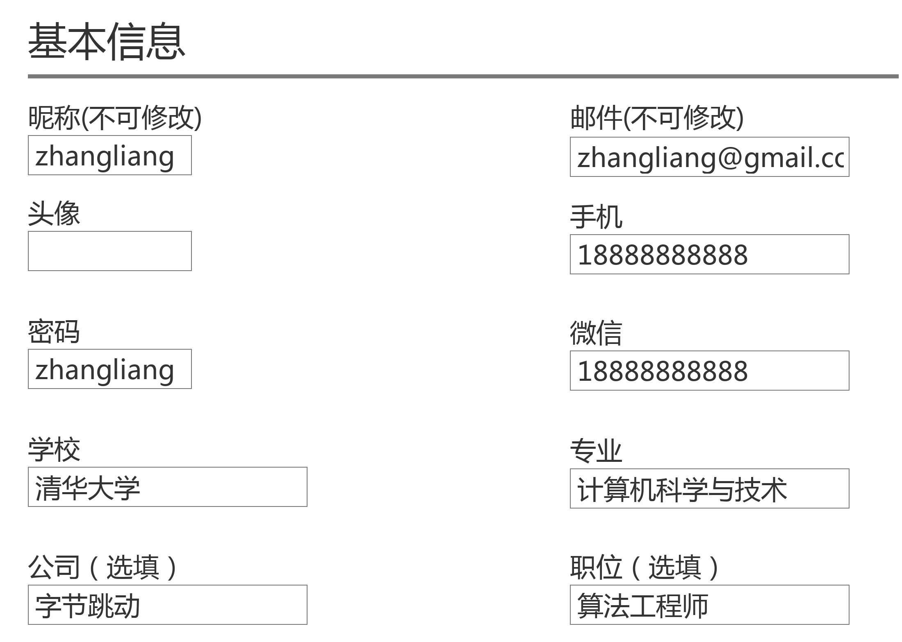

# 前言

本节课程，你将熟悉开发需求，并根据需求设计接口文档并编写接口规范。
本课程所用到的交互稿请查考：https://app.mockplus.cn/app/share-af24fe961aee2bd2b6a6bba9eaf5d8ceshare-pqoGMg0E5c3/rp?hmsr=share

# 用户管理

通过上节课程，你已大概了解Django中现有的接口与Model及后端DB呈现，并能看到用户相关的接口，包括：
* 注册 - register
* 登录 - login
* 登出 - logout
* 个人信息 - me

本节课程你需要扩展用户相关属性，并定义用户管理相关接口。

用户属性界面：

需要基于现有的用户属性，扩充表单中要求的额外属性，如头像、学校、专业等。

1. 编辑[openapi.yaml](./openapi.yaml)中`components.schemas.User`
2. 新增用户增删改查接口文档

# 赛事管理

通过上节课程，你已了解`articles`相关接口并补充了其对应的OpenAPI接口规范文档。本节课你将需要根据
赛事管理的需求设计赛事管理相关的接口。

1. 确定赛事相关属性
2. 编写对应schema
3. 编写增删改查接口文档
