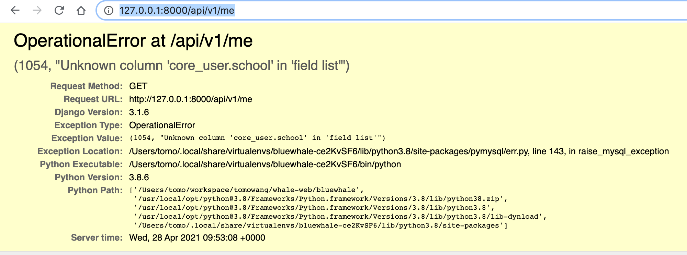
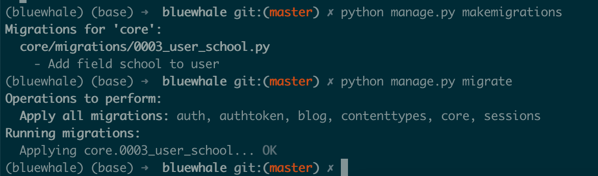
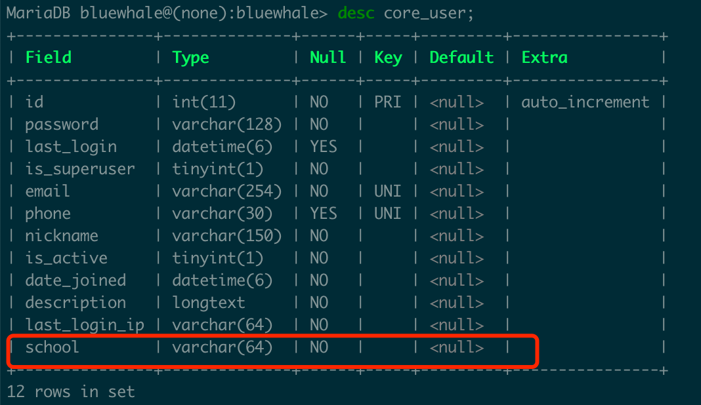
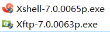
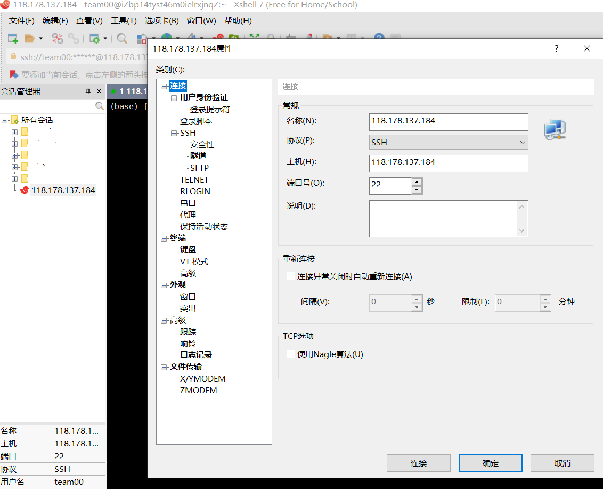
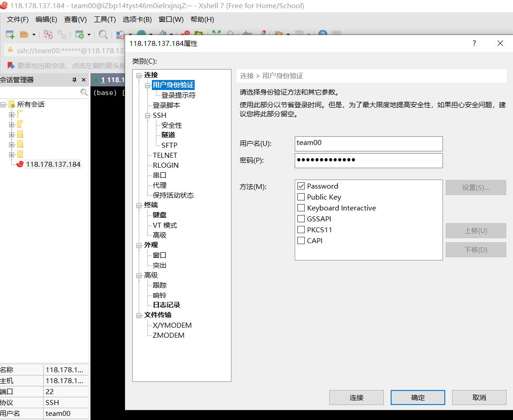
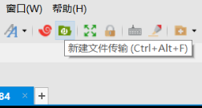
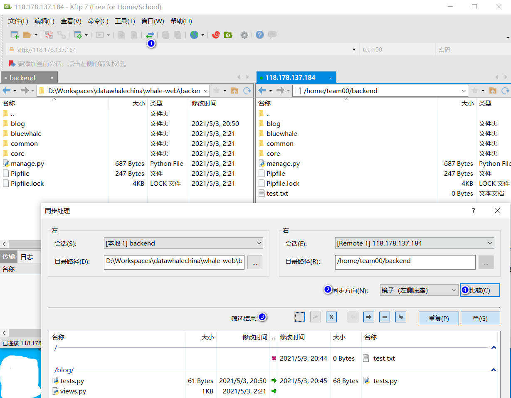

# 前言

本节课程，你将依照在[task02](./task02.md)中编写的用户管理接口规范，实现用户管理相关后端接口及前端界面。

# 后端接口相关

该章节你将学习实现接口所涉及的代码。

## Model & Migrate

在[task01](./task01.md)课程中，你已熟悉`User`这个Model类。按照需求，需要扩展用户相关属性。

如期望增加学校字段`school`，可以在`User`该类中添加相关属性（文件路径`backend/core/models.py`）：

```python
    # 已定义属性
    school = models.CharField(_('school'), max_length=64, blank=True)

    objects = UserManager()
```

保存文件后，你将能看到命令行中展示如下信息：


该信息表明Django识别到文件发生变动，并重新加载了变动。这时再次访问接口
[http://127.0.0.1:8000/api/v1/me](http://127.0.0.1:8000/api/v1/me)将会看到如下错误信息：



这是因为我们新增了字段，但是还没有处理数据。通过`Ctrl+C`停掉后端接口进程，然后执行下面命令可以处理数据库相关事项：

* `python manage.py makemigrations` - 生成migration脚本
* `python manage.py migrate` - 执行migration脚本

执行结果如下：



生成的migration脚本可以在应用目录下面的migrations文件夹中找到。最终我们通过访问数据，
可以发现数据库中`core_user`这个用户表新增一列`school`，如下：



至此数据库相关的修改已完成。

## Serializer

通过`python manage.py runserver`重新启动服务后，再次访问
[http://127.0.0.1:8000/api/v1/me](http://127.0.0.1:8000/api/v1/me)，会发现结果中
并没有`school`属性：

```json
{
    "data": {
        "id": 1,
        "email": "admin@example.com",
        "phone": "",
        "nickname": "",
        "date_joined": "2021-01-25T03:28:09.214616Z",
        "last_login": "2021-04-27T06:22:06.690042Z",
        "last_login_ip": "127.0.0.1",
        "description": "",
        "groups": []
    },
    "code": 0
}
```

原因是我们还需处理序列化相关的代码，增加这部分的序列化配置。文件路径为`backend/core/serializers.py`，
类为`UserSerializer`。通过定义该类中`Meta`类的`fields`属性，我们可以添加我们需要序列化的字段。

添加`school`项，并刷新页面[http://127.0.0.1:8000/api/v1/me](http://127.0.0.1:8000/api/v1/me)，
观察返回的结果数据。

至此序列化相关的修改已完成。

## APIView & URL

要新增用户管理相关后端接口实现，我们需要创建`APIView`并在`urls.py`中添加URL路由至APIView的映射。

`APIView`是一种特殊的类，Django将REST接口相关的增删改查的操作(HTTP Method)映射为`APIView`类中对应的方法：
* 查询列表或单个数据项 - `get -> retrieve`
* 新增 - `post -> create`
* 修改 - `put -> update` & `patch -> partial_update`
* 删除 - `delete -> destroy`

如果需要对特定的接口做特殊的处理，可以通过`Override`实际处理函数进行处理，具体示例可以参考`backend/blog/views.py`
中的处理（该示例中使用非自增的id作为主键，而是使用生成uuid的方式作为主键）：

```python
class ArticleListCreateView(BasicListCreateAPIView):
    permission_classes = [IsAuthenticated|ReadOnly]
    serializer_class = ArticleSerializer
    queryset = Article.objects.all()

    def create(self, request, *args, **kwargs):
        data = request.data
        data['id'] = shortuuid.uuid()
        serializer = self.get_serializer(data=data)
        serializer.is_valid(raise_exception=True)
        self.perform_create(serializer)
        headers = self.get_success_headers(serializer.data)
        return Response(
            {
                'data': serializer.data,
                'code': 0,
            },
            status=status.HTTP_201_CREATED, headers=headers
        )

    def perform_create(self, serializer):
        serializer.save(author=self.request.user)


class ArticleDetailView(BasicRetrieveUpdateDestroyAPIView):
    permission_classes = [IsAuthenticated|ReadOnly]
    serializer_class = ArticleSerializer
    queryset = Article.objects.all()
```

最后在`backend/bluewhale/urls.py`中，对所要的接口路径进行URL与APIView的映射，如：

```python
    path(f'{api_prefix}/articles', ArticleListCreateView.as_view(), name='articles'),
    path(f'{api_prefix}/articles/<pk>', ArticleDetailView.as_view(), name='article'),
```

至此接口及View处理完毕。

# 服务端部署

在本次课程中，我们需要将我们编写的代码上传至服务端并运行（服务器用户及密码等信息由助教提供）。

## 同步后端代码

在clone的项目根目录，运行如下命令：

```shell
export USER=team00      # 替换成助教提供的用户名
export HOST=127.0.0.1   # 替换成助教提供的服务器地址
rsync -avzh --delete --exclude=*.pyc --exclude=.venv --exclude=.idea --exclude=.env \
        --exclude=.git --exclude=__pycache__ \
        backend $USER@$HOST:
```

该命令将后端代码目录同步至远程服务器中。登录到远程服务器，在用户主目录下将看到`backend`文件夹，
其中为后端代码。参考课程[task00](./task00.md)中**环境搭建**-**后端服务**的部分，初始化后端项目db及用户
（远程服务器中已经安装了Python3.8环境，MySQL数据库，并初始化了MySQL的用户，相关步骤可以略过）

最终运行时，运行下列命令（PORT已在环境变量中指定）：

```shell
python manage.py runserver 127.0.0.1:$PORT
```

## 同步前端代码

在clone的项目子目录`client`，编译前端文件，然后同步至服务端：

```shell
npm run build  # 编译前端代码

export USER=team00      # 替换成助教提供的用户名
export HOST=127.0.0.1   # 替换成助教提供的服务器地址
rsync -avzh dist $USER@$HOST:/usr/share/caddy/$USER
```

该命令将编译后的前端代码目录`dist`同步至远程服务器中。
## windows 部署
下载[xshell和xftp](https://www.netsarang.com/en/free-for-home-school/)



>依次安装xshell和xftp

打开xshell并新建连接





在工具栏点击绿色按钮打开文件传输工具xftp



弹出文件夹预览页面（左侧为本地路径，右侧为服务器路径）

> 如果文件夹路径不一致，可以先cd到backend或其他对应目录再打开xftp



确定两边目录一致后,点击下方的传输按钮进行文件夹同步

>也可以将左侧的目录直接拖拽到右侧进行覆盖

如果同步前端代码则注意调整相应的文件目录,方法同backed

部署完成后，打开浏览器输入服务器地址，你将能看到实现的界面。
